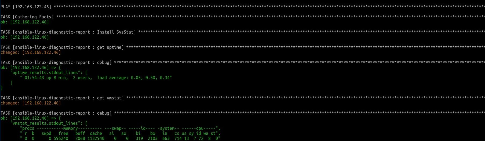

# ansible-linux-diagnostic-report

[](https://travis-ci.org/themizan/ansible-linux-diagnostic-report)

Ansible playbook to automate Netflix's excellent "[Linux Performance Analysis in 60,000 Milliseconds](https://medium.com/netflix-techblog/linux-performance-analysis-in-60-000-milliseconds-accc10403c55)" article.



## Install

Clone repository into your local ansible roles directory.

## Usage

You can use something like the provided ``` run_role.yml ``` playbook to apply the role ad hoc from the command like with something like

``` ansible-playbook run_role.yml -i inventory -e "role=ansible-linux-diagnostic-report" -e "TARGETIP=<host address>" ```

## Known Issues

Playbook may fail running against [CentOS](https://www.centos.org/) when installing systools. Current workaround is to manually install systools with 

``` yum install systools ```

Depending on your use case, it may make more sense to echo the output into a report, then copy the report over to the controlling machine. This is left as an exercise for the reader for the time being.


